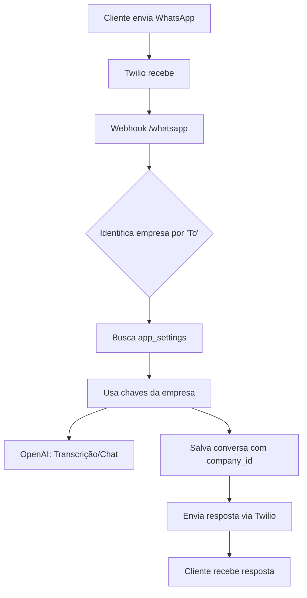

# 🏢 Arquitetura Multi-Tenant - Sistema iMOBI

## 📋 Visão Geral

Este sistema foi projetado como **SaaS multi-tenant**, onde cada empresa cliente opera de forma **isolada** com suas próprias configurações, dados e credenciais.

## 🎯 Objetivo

> **"Quando pronto, eu apenas tenho que criar um acesso para a empresa cliente e tudo funcione de acordo com o login e configurações dela"**

Cada empresa tem:
- ✅ Configurações isoladas (chaves API, credenciais)
- ✅ Dados isolados (leads, conversas, propriedades)
- ✅ Usuários vinculados à empresa
- ✅ WhatsApp próprio
- ✅ Assistente AI personalizado

---

## 🗄️ Estrutura de Dados

### 1. Collection: `companies`

Armazena as empresas clientes do sistema.

```javascript
{
  id: 1,
  name: "Exclusiva Lar Imóveis",
  cnpj: "12.345.678/0001-90",
  email: "contato@exclusivalar.com.br",
  telefone: "(31) 99999-9999",
  endereco: "Belo Horizonte, MG",
  logo: "uuid-do-arquivo",
  status: "active", // active, inactive, archived
  created_at: "2025-01-20T10:00:00",
  updated_at: "2025-01-20T10:00:00"
}
```

### 2. Collection: `app_settings`

Configurações específicas de cada empresa (relação 1:1 com `companies`).

```javascript
{
  id: 1,
  company_id: 1, // FK para companies (UNIQUE)
  
  // OpenAI
  openai_api_key: "sk-proj-...",
  openai_model: "gpt-4o-mini",
  ai_assistant_name: "Teresa",
  
  // Twilio WhatsApp
  twilio_account_sid: "ACxxxxxxxxxxxxxxxx",
  twilio_auth_token: "xxxxxxxxxxxxxxxxxx",
  twilio_whatsapp_number: "whatsapp:+5531999999999",
  
  // Webhooks e APIs externas
  webhook_url: "http://localhost:8055/whatsapp",
  external_api_url: "https://api.creci.com.br",
  external_api_key: "key-externa",
  
  // Status
  is_active: true,
  created_at: "2025-01-20T10:00:00",
  updated_at: "2025-01-20T10:00:00"
}
```

### 3. Collections com Multi-Tenancy

Todas as collections de dados têm campo `company_id`:

- ✅ `leads` → company_id (FK)
- ✅ `conversas` → company_id (FK)
- ✅ `mensagens` → company_id (FK via conversa)
- ✅ `properties` → company_id (FK)
- ✅ `imoveis_interesse` → company_id (FK)
- ✅ `diagnosticos` → company_id (FK via lead)
- ✅ `atividades` → company_id (FK)

### 4. Usuários (directus_users)

Campo adicional: `company_id` (FK para `companies`)

```javascript
{
  id: "uuid",
  first_name: "João",
  last_name: "Silva",
  email: "joao@exclusivalar.com.br",
  role: "uuid-role-admin-empresa",
  company_id: 1, // FK para companies
  status: "active"
}
```

---

## 🔐 Sistema de Permissões

### Roles (Papéis)

1. **Super Admin** (Você)
   - Acesso total ao sistema
   - Gerencia todas empresas
   - Cria empresas e usuários

2. **Admin Empresa**
   - Acesso completo aos dados da **sua empresa**
   - Gerencia usuários da empresa
   - Edita configurações da empresa

3. **Corretor**
   - Acesso aos leads/conversas da **sua empresa**
   - Pode atender WhatsApp
   - Visualiza propriedades

4. **Gerente**
   - Acesso completo da **sua empresa**
   - Relatórios e dashboards
   - Não edita configurações

### Filtros de Permissão

Para cada role (exceto Super Admin), aplicar filtro automático:

```json
{
  "_and": [
    {
      "company_id": {
        "_eq": "$CURRENT_USER.company_id"
      }
    }
  ]
}
```

---

## 🛠️ Helper de Configurações

Criado em `directus/extensions/shared/company-settings.js`

### Funções disponíveis:

```javascript
// 1. Por company_id
const settings = await getCompanySettings(services, companyId);

// 2. Por user_id (pega company_id do usuário)
const settings = await getCompanySettingsByUser(services, userId);

// 3. Por número WhatsApp (webhook)
const settings = await getCompanySettingsByWhatsApp(services, 'whatsapp:+5531999999999');

// 4. Por CNPJ
const settings = await getCompanySettingsByCNPJ(services, '12.345.678/0001-90');

// 5. Listar todas empresas ativas
const companies = await listActiveCompaniesWithSettings(services);

// 6. Validar configurações
const validation = validateCompanySettings(settings);
// { valid: true/false, missing: ['campo1', 'campo2'] }
```

---

## 📡 Extensões Multi-Tenant

### 1. OpenAI Service (`/openai/*`)

**Recebe:** `company_id` ou `user_id`

```javascript
POST /openai/transcribe
{
  "company_id": 1,  // ou user_id
  "audio_url": "..."
}

// Internamente:
const settings = await getCompanySettings(services, company_id);
const response = await fetch('https://api.openai.com/v1/audio/transcriptions', {
  headers: {
    'Authorization': `Bearer ${settings.openai_api_key}`
  }
});
```

### 2. Twilio Client (`/twilio/*`)

**Recebe:** `company_id`

```javascript
POST /twilio/send-message
{
  "company_id": 1,
  "to": "+5531999999999",
  "message": "Olá!"
}

// Internamente:
const settings = await getCompanySettings(services, company_id);
const twilioClient = new TwilioClient(
  settings.twilio_account_sid,
  settings.twilio_auth_token
);
```

### 3. WhatsApp Webhook (`/whatsapp`)

**Recebe:** Webhook do Twilio/Evolution API

```javascript
POST /whatsapp
{
  "From": "whatsapp:+5531988887777",  // cliente
  "To": "whatsapp:+5531999999999",    // empresa
  "Body": "Olá, tenho interesse..."
}

// Internamente:
// 1. Identifica empresa pelo número To
const settings = await getCompanySettingsByWhatsApp(services, webhookData.To);

// 2. Usa configurações da empresa
const openAI = new OpenAIClient(settings.openai_api_key);
const twilioClient = new TwilioClient(
  settings.twilio_account_sid,
  settings.twilio_auth_token
);

// 3. Salva dados com company_id
await conversasService.createOne({
  company_id: settings.company_id,
  telefone: webhookData.From,
  // ...
});
```

---

## 🚀 Fluxo de Onboarding (Nova Empresa)

### 1. Super Admin cria empresa

```
http://localhost:8055/admin/content/companies
+ Criar Item
  - Nome: "Imobiliária ABC"
  - CNPJ: 98.765.432/0001-00
  - Email: contato@imobabc.com.br
  - Status: active
```

### 2. Super Admin cria configurações

```
http://localhost:8055/admin/content/app_settings
+ Criar Item
  - Company: Imobiliária ABC
  - OpenAI API Key: sk-proj-...
  - OpenAI Model: gpt-4o-mini
  - AI Assistant Name: Laura
  - Twilio Account SID: ACxxxx
  - Twilio Auth Token: xxxxx
  - Twilio WhatsApp Number: whatsapp:+5511988887777
  - Webhook URL: http://localhost:8055/whatsapp
  - Is Active: true
```

### 3. Super Admin cria usuário

```
http://localhost:8055/admin/users
+ Criar Usuário
  - Email: admin@imobabc.com.br
  - Nome: Maria Silva
  - Role: Admin Empresa
  - Company: Imobiliária ABC  ← IMPORTANTE!
  - Status: active
```

### 4. ✅ Sistema pronto!

O usuário `admin@imobabc.com.br` agora:
- Faz login no Directus
- Vê APENAS dados da Imobiliária ABC
- WhatsApp configurado automaticamente
- AI personalizada (Laura)
- Webhooks funcionando

---

## 🔄 Fluxo de Mensagem WhatsApp



---

## 📊 Dashboard Multi-Tenant

No Next.js, o dashboard deve:

1. **Autenticar** via Directus (JWT)
2. **Pegar `company_id`** do usuário logado
3. **Filtrar automaticamente** todos dados

```javascript
// src/lib/directus/client.ts
export async function getLeadsByCompany() {
  const user = await getCurrentUser();
  
  return directus.items('leads').readByQuery({
    filter: {
      company_id: user.company_id
    }
  });
}
```

---

## ✅ Checklist de Implementação

### Estrutura Base
- ✅ Collection `companies` criada
- ✅ Collection `app_settings` criada
- ✅ Helper `company-settings.js` criado
- ⏳ Adicionar `company_id` em `directus_users`
- ⏳ Configurar Roles e Permissions

### Extensões
- ⏳ Atualizar `/openai/*` para multi-tenant
- ⏳ Atualizar `/twilio/*` para multi-tenant
- ⏳ Atualizar `/whatsapp` para multi-tenant

### Frontend
- ⏳ Sistema de login com company_id
- ⏳ Filtros automáticos por empresa
- ⏳ Dashboard por empresa

### Testes
- ⏳ Testar isolamento de dados
- ⏳ Testar webhooks multi-empresa
- ⏳ Testar permissões

---

## 🎓 Exemplo Prático

### Cenário: 3 empresas usando o sistema

| Empresa | WhatsApp | AI Assistant | Dados |
|---------|----------|--------------|-------|
| Exclusiva Lar | +5531999999999 | Teresa | 50 leads |
| Imobiliária ABC | +5511988887777 | Laura | 30 leads |
| Casa Prime | +5521977776666 | Roberto | 20 leads |

**Webhook recebe mensagem para +5511988887777:**

1. Sistema identifica: Imobiliária ABC
2. Busca configurações da ABC
3. Usa chave OpenAI da ABC
4. Usa credenciais Twilio da ABC
5. Salva conversa com `company_id = 2` (ABC)
6. Responde usando assistente "Laura"

**Usuário da Exclusiva faz login:**

- Vê apenas os 50 leads da Exclusiva
- Não vê leads da ABC ou Casa Prime
- Dashboard mostra métricas da Exclusiva
- Pode editar apenas propriedades da Exclusiva

---

## 🔒 Segurança

1. **Isolamento de dados**: Filtros automáticos em todas queries
2. **Credenciais isoladas**: Cada empresa tem suas chaves API
3. **Permissões granulares**: Roles com filtros por company_id
4. **Validação**: Helper valida se empresa tem todas configurações
5. **Logs auditoria**: Rastrear ações por empresa

---

## 📝 Próximos Passos

1. ✅ Criar empresas e configurações via UI
2. ⏳ Adicionar campo `company_id` em `directus_users`
3. ⏳ Configurar Roles e Permissions
4. ⏳ Atualizar extensões para usar helper
5. ⏳ Implementar filtros no frontend
6. ⏳ Testar cenário completo

---

**Documentação criada em:** 2025-01-20  
**Sistema:** iMOBI Multi-Tenant SaaS  
**Status:** 🚧 Em desenvolvimento
